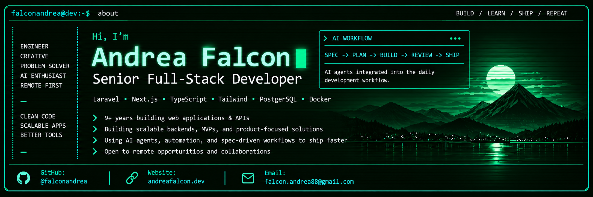

  

I'm a **Senior Full-Stack Developer** with 9+ years of experience building web applications, APIs, and digital products.

My core stack is **Laravel / PHP** on the backend and **Next.js / Astro / TypeScript** on the frontend, with PostgreSQL, Tailwind CSS and Docker as part of my daily workflow.

Beyond the stack itself, I'm particularly interested in **AI-assisted and agentic software development**.

I don't use AI as a substitute for engineering judgment or as a "vibe-coding" shortcut. With years of development experience behind me, I use AI agents, automation and spec-driven workflows to reduce repetitive work and move faster on implementation — so I can spend more time on higher-level decisions such as architecture, performance, scalability, code quality, optimization and product trade-offs.

Currently open to **fully remote opportunities** and relocation outside Italy, especially in product-focused and fast-moving teams.

📄 **[Resume 2026](https://andreafalcon.dev/cv)**  
🌐 **[andreafalcon.dev](https://andreafalcon.dev)**

## 🚀 Featured Projects

### [CraftCV](https://craftcv.online)

ATS-friendly CV generator built with **Next.js, Tailwind CSS and Docker**.

Built using a **spec-driven, AI-assisted development workflow**, from product definition to implementation and iteration.

`Next.js` `TypeScript` `Tailwind CSS` `Docker`

---
  
### [Careguru](https://careguru.io)

Platform connecting caregivers with families, developed as a real-world product from **MVP to public release**.

`Laravel` `PostgreSQL` `Next.js` `Tailwind CSS` `Docker`

---

### [Appunti dal Giappone](https://appuntidalgiappone.it)

Content-focused travel website where I publish guides, tips and personal notes about travelling in Japan.

Built with **Astro**, with a focus on performance, simplicity and SEO.

`Astro` `TypeScript` `Content`

## 🤖 How I work with AI

AI is part of my development workflow, but not a replacement for engineering judgment.

I use agents and automation across different stages of development:

**SPEC → PLAN → BUILD → REVIEW → SHIP**

This includes exploring requirements, breaking features into implementation plans, generating and reviewing code, investigating bugs, documenting decisions and reducing repetitive work.

My goal is not to produce more code for the sake of it. I use AI to **increase leverage** and free up time for the parts of software development where experience matters most:

- Architecture and system design
- Performance and database optimization
- Code quality and maintainability
- Scalability and technical trade-offs
- Product decisions and implementation strategy
- Reviewing and validating AI-generated output

In other words, AI helps me move faster at the implementation layer while I stay focused on the higher-level engineering decisions.

## 📈 Product, SEO & Analytics

When I build a product, I try to think beyond the application code itself.

I also spend time on the parts that help a project perform well after launch:

- Technical SEO and structured metadata
- GEO / AI-search discoverability
- Performance and Core Web Vitals
- Analytics and conversion tracking
- Google Tag Manager setup
- Consent management and cookie compliance
- Monitoring and iterating based on real usage data

I like working on products end-to-end: from architecture and implementation to launch, measurement and optimization.

## 🔨 Currently

- Building and iterating on **MVPs and side projects**
- Working primarily with **Laravel, Next.js, Astro and TypeScript**
- Experimenting with **AI agents, coding agents and spec-driven development**
- Improving my workflows around automation and developer productivity
- Interested in international and remote-first product teams

## ⚡ Core Technologies

**Backend**

**Frontend**

**Tools & Infrastructure**

**Product & Analytics**

## 🕰️ Previous Experience

From 2022 to 2024 I explored the Web3 ecosystem, working with Solidity and Ethereum tooling.

During that period I:

- Completed the [Alchemy University](https://university.alchemy.com/) Ethereum Developer Bootcamp
- Won multiple bounties on [LearnWeb3DAO](https://learnweb3.io/)
- Participated in Web3 hackathons and conferences including ETHMilan, NapulETH and NFTLisbon
- Contributed to the [phpMyAdmin open-source project](https://github.com/phpmyadmin/phpmyadmin/pull/17665)

## 📫 Get in touch

<!---
falconandrea/falconandrea is a ✨ special ✨ repository because its `README.md` (this file) appears on your GitHub profile.
You can click the Preview link to take a look at your changes.
--->
